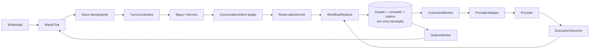
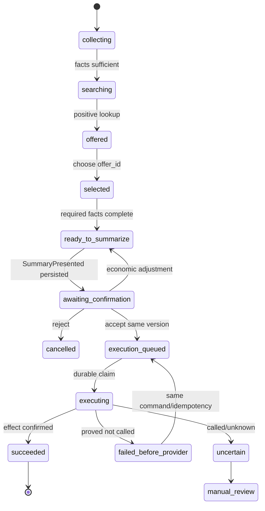

# Arquitetura-alvo

## Visão geral



## Ownership

| Componente | Decide | Não decide |
|---|---|---|
| Maya | intenção, fatos conversacionais, tom, dúvida/aceite/ajuste | autorização, provider técnico, retry, idempotência |
| `TurnCoordinator` | lock, deadline conversacional, ordem e persistência do turno | regra comercial ou payload provider |
| `ReservationKernel` | seleção, versão comercial, assinatura, FSM, allow/block/command | HTTP, texto livre, entrega |
| `WorkflowReducer` | `estado + evento → estado + comandos` | efeitos externos |
| `CommandWorker` | claim, execução única e reconciliação | interpretação do cliente |
| `ProviderAdapter` | schema técnico e normalização da resposta | confirmação e mensagem pública |
| Ledger | exatamente uma tentativa/evidência comercial | entrega ao cliente |
| Outbox | entrega eventual de mensagem já decidida | reserva/pagamento |

## Tipos centrais

### `ConversationIntent`

```text
kind: provide_facts | choose_offer | confirm | reject | adjust | ask | handoff
facts: campos conversacionais tipados
confidence: diagnóstico, nunca autorização
source_event_id
```

### `LookupEvidence`

```text
lookup_id
service
query_signature
observed_at
expires_at
provider_snapshot_hash
status: positive | negative | uncertain
```

### `OfferSnapshot`

```text
offer_id             # identidade interna opaca
lookup_id
service               # lodging | activity
provider_ref          # privado
public_label          # apresentação somente
dates / start_time
party
price / currency
add_ons
availability
```

### `CommercialDraft`

```text
draft_id
draft_version
components[]
customer_facts
economic_terms
status
subject_signature
```

### `SummaryPresented`

```text
summary_event_id
draft_id
draft_version
subject_signature
outbox_message_id
presented_at
```

### `ConfirmationDecision`

```text
confirmation_event_id
decision: accept | reject | adjust | ambiguous
target_draft_version
source_event_id
```

### `ReservationCommand`

```text
command_id
idempotency_key
draft_id
draft_version
subject_signature
operation
canonical_payload
status: queued | claimed | executing | succeeded | failed_before_provider | uncertain
attempt
```

### `ExecutionOutcome`

```text
certainty:
  not_called
  called_no_effect
  effect_confirmed
  called_unknown
provider_reference?
normalized_status
claim_evidence
```

A agregação de operações compostas é monotônica: `called_unknown` nunca vira `not_called`; `effect_confirmed` exige evidência correspondente.

## Máquina de estados



## Transação de confirmação

A confirmação válida precisa persistir atomicamente:

1. evento de confirmação;
2. transição para `execution_queued`;
3. `ReservationCommand` imutável;
4. idempotency key;
5. mensagem/outbox apropriada, se houver.

O provider não é chamado nessa transação.

## Execução

O worker:

1. lê comando pendente;
2. obtém claim durável;
3. reconstrói payload apenas do estado canônico;
4. chama adapter com timeout próprio;
5. grava `ExecutionOutcome`;
6. aplica evento ao reducer;
7. enfileira mensagem final.

## Persistência

Preferência: Postgres/Supabase com constraints e transação/RPC. Requisitos mínimos:

- optimistic version no workflow;
- unique `(workflow_id, draft_version, operation)`;
- unique idempotency key;
- comando e estado atômicos;
- lease recuperável do worker;
- ledger durável obrigatório em live;
- outbox com lease/recovery.

## Compatibilidade

Migração por `dual-read/single-write`:

- ler estado legado durante janela definida;
- converter para modelo tipado;
- escrever somente o modelo novo;
- comparar decisões em shadow;
- remover campos legados após não haver workflows ativos dependentes.
