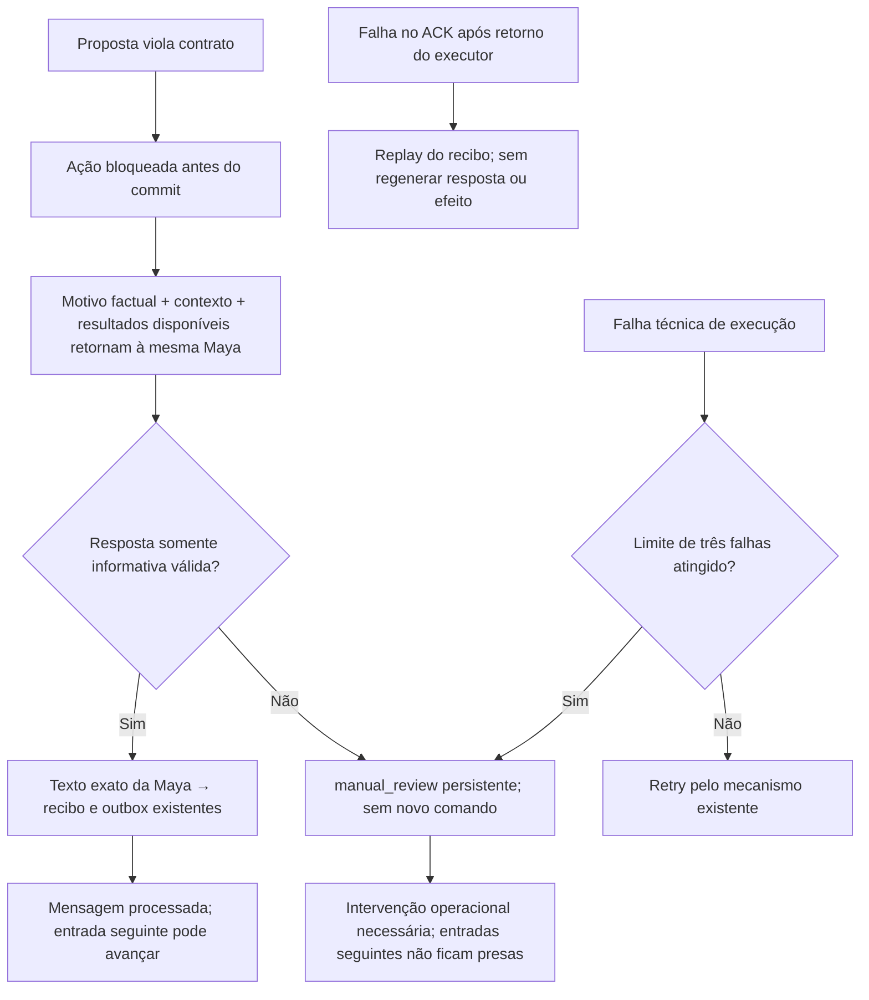

# Continuidade após rejeição — correção local

## Escopo e resultado

- Base imutável: `8f92904637e047d0c10f9a7a15fb621070ab112f`.
- Candidato: branch `refactor/v2-atendimento-simples-727d3625`, neste commit.
- Solicitação: implementar a continuidade após proposta inválida sem adicionar camadas.
- Sem deploy, tráfego real, reservas/pagamentos reais ou alterações no runtime ativo.
- Sem alterações em V3, legado, ManyChat, Maya Ops ou bancos ativos.

## Caminho implementado

A continuação não é revisão de texto válido. É uma chamada adicional da mesma Maya
para comunicar a recusa de uma ação. O controlador não escreve a resposta.
Não há execução da ação recusada, nova consulta ou coleta de fatos nessa continuação;
uma pergunta ao cliente continua permitida. O cliente pode fornecer o que falta em
uma nova mensagem, processada normalmente.

### Mudanças pequenas nos donos existentes

- `ModelRequest.action_rejection` transporta o motivo; adapter/prompt explicam o modo informativo.
- O executor usa uma função comum para rejeições de contrato, progressão comercial
  bloqueada, autoridade pós-consulta, rodada extra de consulta e expiração da aprovação.
- Texto final é persistido integralmente pelo caminho existente. Fatos disponíveis,
  passageiros, perfil e observações permanecem no contexto; a revogação tipada na
  primeira interpretação não é restaurada por uma continuação inválida.
- Resposta de recuperação que tenta selecionar, consultar ou alterar fatos encerra
  o lote em `manual_review`; não reinicia automaticamente a ação recusada.
- A inbox existente recebe apenas `failure_count` e `failure_reason`, com migração
  aditiva. Falhas de execução esgotam em três tentativas, inclusive após reabertura.
- Falhas de ACK depois do retorno do executor não consomem esse orçamento: o recibo
  comprometido precisa continuar recuperável sem novos comandos ou mensagens.
- Não foram criados agente, banco, fila, revisor semântico, classificação por texto
  do cliente ou protocolo externo de retry.

## Verificação executada

| Rodada | Resultado |
|---|---|
| Testes novos de continuidade | 14 passaram |
| Focais finais | 192 passaram |
| Integral final do candidato | 7 failed, 2261 passed, 2 warnings, 2958 subtests passed in 380.72s (0:06:20) |
| Integral da base com Git preservado | 7 failed, 2247 passed, 2 warnings, 2958 subtests passed in 387.89s (0:06:27) |
| Comparação das falhas | Mesmos sete IDs na base e no candidato |
| Fontes conferidas por SHA-256 | 9 arquivos de código/prompt/teste |
| Ruff, compilação, diff e fronteiras | Passaram |
| Autoridade do runtime antes/depois | OK |

O teste atravessa inbox, worker, executor, armazenamento SQLite e outbox reais locais,
com modelo/ports simulados e rede bloqueada nos 14 cenários novos. Inclui pergunta
parseada pelo adapter real, retenção de observações/pessoas, retomada por recibo,
falha transitória e esgotamento durável. Não prova qualidade de uma Maya real nem
aceitação/entrega de uma mensagem pelo ManyChat.

TDD: os logs 61, 64 e 66 registram recusas/ausência de continuação e falhas de
progressão antes das correções. Os 14 cenários novos também foram executados contra
a base imutável. Três falhas dessa comparação são diferenças de API/schema novos
(adapter, migração e coluna do orçamento), não testemunhos comportamentais; não
são usadas isoladamente como prova de regressão corrigida.

Uma rodada preliminar da base exportada por `git archive` teve uma oitava falha:
o teste de identidades históricas usa `git show`. O harness foi corrigido para um
clone local compartilhado em HEAD destacado. A rodada válida é a 75, não a 71.
Nenhum teste de produto foi alterado para esconder essa falha de ambiente.

### Falhas históricas que permanecem

- `tests/test_phase7_closeout.py::Phase7EntryContractTests::test_wheel_bootstrap_is_closed_and_stdlib_only`
- `tests/test_phase7_closeout.py::Phase7CloseoutContractTests::test_evidence_validator_reflects_current_terminal_artifacts`
- `tests/test_phase7_closeout.py::Phase7CloseoutContractTests::test_manifest_is_deterministic_current_and_covers_runtime_patch`
- `tests/test_phase7_package.py::Phase7PackageTests::test_installed_wheel_imports_without_checkout_on_sys_path`
- `tests/test_phase7_package.py::Phase7PackageTests::test_project_metadata_declares_closed_distribution`
- `tests/test_phase7_package.py::Phase7PackageTests::test_two_builds_are_byte_identical_closed_and_self_hashing`
- `tests/test_phase8_entry.py::Phase8EntryTests::test_phase_index_keeps_slice_zero_and_rollout_closed`

A integral **não está totalmente verde**. Este resultado é uma correção local com
zero novos IDs de falha, não autorização para promoção ou deploy.

## Limites operacionais explícitos

`manual_review` é um estado durável de intervenção, não um handoff humano entregue.
Se a Maya/infraestrutura não consegue produzir e persistir uma resposta válida, o
cliente ainda pode ficar sem uma mensagem pública. A diferença é que a tentativa
não é repetida indefinidamente e a fila do lead não fica presa nela. Não há aviso
humano automático novo nesta mudança.

As recusas recuperadas ocorrem antes de novo comando comercial comprometido.
Incerteza de efeito externo não autoriza repetir a reserva/pagamento. Os controles
anteriores de idempotência, autorização, CAS, frescor e execução continuam vigentes.

## Artefatos e reprodução

Diretório local: `/home/ubuntu/workspace/v2-simplificacao-atendimento-727d3625`.

- `74-rejection-base-causal-git.txt`: cenários novos na base.
- `75-rejection-base-full-git.txt`: integral da base em clone com histórico.
- `76-rejection-final-full.txt`: integral final do candidato.
- `77-rejection-final-focused.txt`: focais finais.
- `73-rejection-tested-sources.json`: hashes dos arquivos testados.
- `78-rejection-evidence-seal.json`: comparação e hashes dos logs.
- `check-rejection-base.py`: reprodução isolada da base.
- `verify_rejection_evidence.py`: compara falhas, contagens e hashes; exit 0.

Execução com Python 3.12, `env -i`, `PYTEST_DISABLE_PLUGIN_AUTOLOAD=1`,
`HERMES_LEADS_AGENT_CONFIG_PATH=/dev/null` e dependências temporárias via `uv --no-project`.
