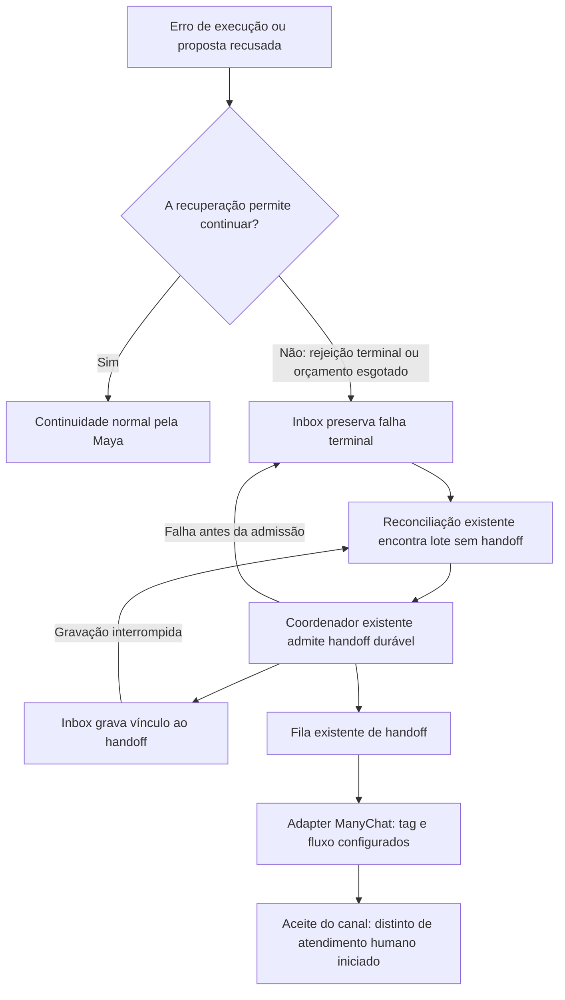

# V2 — handoff obrigatório após falha impeditiva

Execução local: 2026-09-19 (UTC). Base imutável: `b8e974aec2efdd01e1e5d6c9cc2b1f87b9a67acd`.

## Requisito e limite de autorização

Carlos: “se durante algum atendimento um erro ocorrer que impeça o andamento do atendimento, o handoff deve ocorrer para um humano”. `manual_review` sem consumidor não atende ao requisito.

Correção incremental local, sem subagentes, nova fila, novo banco, segundo agente, texto público fabricado ou mudança de autoridade semântica. Nenhum deploy, envio real ao ManyChat, reserva, pagamento, edição de SQLite ativo, alteração de GA/test, V3, legado ou Maya Ops.

## Defeito causal e correção

O limite persistente encerrava lotes inválidos/que esgotaram tentativas, mas o projetor de handoff existente só examinava execução de reservas. A composição real não encaminhava falhas terminais de inbox. Além disso, o resolvedor de destinatário dependia de um estado conversacional já comprometido, ausente quando o primeiro atendimento falhava antes do commit.

Agora, no candidato:

- `SQLiteInbox`: migração aditiva de uma coluna `handoff_id`; leitura de lotes terminais ainda não vinculados e gravação do vínculo após admissão durável. Sem novo status/fila/tabela.
- `ManualReviewHandoffProjector`: reutiliza `HandoffCoordinator` para os lotes terminais; executa antes das sondagens de reads externas.
- `HandoffCoordinator`: recupera o mesmo incidente inclusive se um operador o encerrou entre a admissão e o vínculo; não reabre o encaminhamento.
- `DurableLeadResolver`: considera a identidade do evento de entrada aceito, mesmo sem estado conversacional gravado. Preserva isolamento por lead.
- Composição de produção: liga inbox ao projetor e resolvedor existentes. O encaminhamento não depende de outra resposta da Maya.
- Falha transitória ainda recuperável não gera handoff prematuro. Falha de ACK depois de uma resposta comprometida continua reaproveitando o recibo, sem consumir orçamento de execução ou repetir efeitos comerciais.

## Testemunhas executadas

`tests/test_v2_blocking_error_handoff.py`: doze cenários com stores reais temporários, workers compostos por `build_worker_set`, HTTP transport do ManyChat sobre `httpx.MockTransport`, relógio controlado e sockets negados.

1. Esgotamento técnico → reinício → handoff → chamadas exatas de tag/fluxo.
2. Rejeição terminal → reinício → handoff, mesmo sem `boundary_state`.
3. Falha transitória isolada não abre handoff.
4. Executor real + duas propostas inválidas → dois calls de modelo → handoff, sem terceira tentativa da Maya.
5. Admissão seguida de falha ao vincular a inbox → reinício → mesmo encaminhamento.
6. Dois lotes do mesmo lead compartilham handoff; outro lead possui destinatário próprio.
7. Três falhas de ACK pós-commit → uma resposta/model call e nenhum handoff espúrio.
8. Encerramento pelo operador depois do vínculo → não reabre.
9. Encerramento pelo operador antes de recuperar vínculo interrompido → não reabre.
10. Falha antes da admissão → lote continua recuperável após reinício.
11. Read probe indisponível → handoff já admitido pode ser entregue pelo worker independente.
12. Migração do schema predecessor preserva falha, contador e elegibilidade de encaminhamento.

RED causal em `84-handoff-red.txt`: quatro falhas de comportamento (nenhum handoff), uma ausência da nova API, dois controles verdes. Interrupção/encerramento revelou `IdentityConflict` em `86-handoff-replay-red.txt` (1 falhou, 11 passaram), corrigido no coordenador. Tentativas anteriores 82/83 e 85 tiveram defeitos de fixture; não contam como prova causal do produto.

## Resultados

- Focais: **65 passaram**, incluindo os doze cenários novos, continuidade de rejeição, inbox, reconciliação, entrega de handoff e composição.
- Ruff 0.15.10 nos alvos, compileall, `git diff --check` e fronteiras: OK.
- Autoridade do runtime verificada antes e durante o trabalho: OK.
- Integral: **2273 testes e 2958 subtestes passaram**, com os mesmos **sete testes históricos falhando**, sem novos IDs de falha (`88-handoff-full.txt`, 279.79s). A suíte integral não está verde.

Artefatos: `/home/ubuntu/workspace/v2-simplificacao-atendimento-727d3625/`. `89-handoff-tested-sources.json` fixa fontes testadas; `verify_handoff_evidence.py` verifica hashes, vínculo da base imutável ao relatório predecessor e identidade dos testes falhando. O integral predecessor não é uma reexecução nesta etapa: seu log e fontes são verificados por hash contra o commit base.

## Fronteira de prova

Os testes comprovam o caminho local até as chamadas do adapter de canal e seus recibos simulados. Não comprovam entrega WhatsApp real, atribuição/alerta a um operador na configuração ativa do ManyChat nem que uma pessoa iniciou atendimento. O workflow/tag/flow já existente continua sendo o mecanismo de handoff; sua habilitação e eventual promoção permanecem sujeitos aos gates existentes. Falha no próprio canal mantém o comportamento operacional existente e não é reportada como entrega bem-sucedida.

**Sem deploy. Runtime ativo inalterado.**
