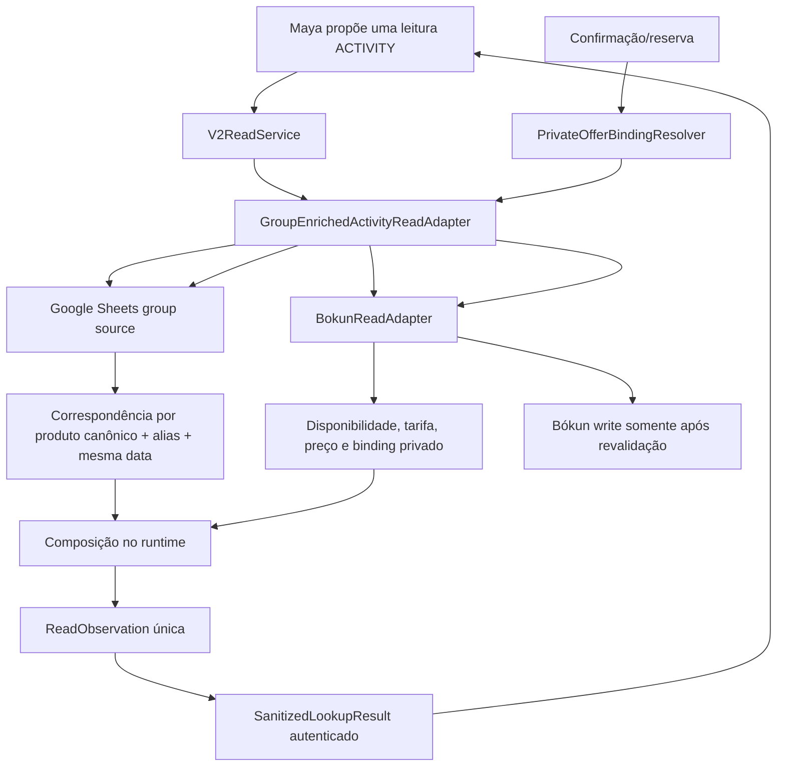

# Maya V2: consulta composta Bókun + grupos — especificação

**Data:** 2026-08-13

## Objetivo

Toda consulta de disponibilidade de passeio da Maya V2 continua sendo uma única `ReadKind.ACTIVITY`, mas o runtime consulta a fonte de grupos e o Bókun no mesmo fluxo e devolve uma única observação autenticada ao agente.

A Maya não recebe uma nova tool e não coordena providers.

## Arquitetura



## Regras de disponibilidade

### Consultas de 2 ou mais participantes

1. A planilha e o Bókun são sempre consultados no mesmo read.
2. O Bókun continua sendo a autoridade para disponibilidade, preço e binding de reserva.
3. Grupo encontrado para o mesmo produto e data:
   - `group_status = matched`;
   - `existing_group = true`;
   - `group_participants` recebe apenas a soma agregada correspondente.
4. Nenhum grupo correspondente:
   - `group_status = not_matched`;
   - `existing_group = false`.
5. Falha ou resposta inválida da planilha:
   - o resultado Bókun ainda pode ser oferecido;
   - `group_status = unavailable`;
   - `existing_group = false`.
6. Falha ou indisponibilidade Bókun nunca é compensada pela planilha.

### Uma pessoa em passeio de mínimo operacional 2

O primeiro escopo é fechado nos seis produtos recuperados da V1:

- `product:aguas-claras` → Bókun `913781`, rate `2375647`;
- `product:buracao` → Bókun `913372`, rate `2375672`;
- `product:mixila-1d` → Bókun `913776`, rate `2375659`;
- `product:marimbus` → Bókun `913348`, rate `2375663`;
- `product:pati-4d` → Bókun `1001204`, rate `2375428`;
- `product:pati-5d` → Bókun `1001205`, rate `2375667`.

A categoria adulta histórica é `1160099`.

Para esses produtos, quando `adults + children == 1`:

1. Sem grupo correspondente no mesmo produto e data: o runtime não oferece a opção.
2. Planilha indisponível ou inválida: o runtime não oferece a opção.
3. Com grupo correspondente: o runtime solicita ao Bókun exatamente a tarifa e categoria de grupo configuradas.
4. A tarifa, a categoria, o horário, a capacidade, o preço e o quote/checkout precisam existir e ser aceitos na resposta atual do Bókun; IDs históricos nunca são aceitos cegamente.
5. O binding privado e o `offer_id` são derivados dos campos realmente validados pelo Bókun.
6. No `resolve()` anterior ao write, o runtime consulta novamente a planilha e o Bókun. Se o grupo sumiu, a fonte está indisponível, a tarifa divergiu, o preço mudou ou o binding não é idêntico, a reserva para antes de qualquer write de reserva.
7. Não se generaliza automaticamente para produtos fora da lista fechada.

## Correspondência de grupo

A política de correspondência cobre todos os 16 produtos de
`config/v2_bokun_product_map.json`. O subconjunto de seis produtos acima limita
somente a exceção solo de mínimo 2; não limita a consulta da planilha nem o
enriquecimento comercial normal.

Para todo `ReadKind.ACTIVITY`, inclusive produtos sem grupo encontrado, a fonte
da planilha é consultada. Um produto do mapa ativo precisa ter aliases fechados
na política versionada; divergência entre os dois catálogos bloqueia a
composição produtiva.

A correspondência exige simultaneamente:

- data ISO exatamente igual à data consultada;
- produto canônico conhecido;
- nome da planilha normalizado e correspondente a um alias fechado daquele produto;
- participantes agregados maiores que zero.

A normalização remove acentos, caixa e excesso de espaços. Não haverá substring aberta entre produtos; apenas igualdade após normalização dos aliases versionados.

Linhas da planilha com data vazia herdam a última data válida, como na V1.

## Contrato público entregue à Maya

Novas ofertas de passeio carregam contexto tipado:

```json
{
  "group_status": "matched | not_matched | unavailable",
  "existing_group": true,
  "group_participants": 3,
  "solo_group_booking": false
}
```

Invariantes:

- `matched` exige `existing_group=true` e `group_participants >= 1`;
- `not_matched` ou `unavailable` exigem `existing_group=false` e `group_participants=null`;
- `solo_group_booking=true` exige `matched`, exatamente um participante e produto pertencente à política fechada;
- hospedagem não pode carregar contexto de grupo.

`SanitizedOffer` ganha wire v2, mas o decoder continua aceitando e reserializando observações v1 já persistidas sem alterar seus bytes.

O contexto também entra no `consultation_history`, para sobreviver aos turnos seguintes. Ele informa recomendação, mas histórico antigo nunca autoriza reserva: o `resolve()` fresco continua obrigatório.

## Contrato privado

- O `query_hash` comercial permanece inalterado.
- O catálogo de campos privados Bókun permanece fechado (`bokun_product_id`, `start_time_id`, `rate_id`, `adult_pricing_category_id` e categoria infantil quando aplicável).
- Enriquecimento de grupo para 2+ não muda `offer_id` nem binding Bókun.
- O caminho solo usa um binding Bókun real formado com a tarifa/categoria individual de grupo validada.
- Metadados da planilha não entram no payload privado do provider write.

## Configuração e dados

- A URL CSV da planilha pertence ao worker e é fornecida por `V2_BOKUN_GROUPS_SHEET_CSV_URL`.
- O processo API não recebe essa configuração.
- A política fechada de aliases cobre todos os produtos do mapa Bókun ativo; a
  seção separada de tarifas solo contém somente os seis produtos mínimo-2.
- A composição produtiva só inicia com URL HTTPS válida e política consistente com `V2_BOKUN_PRODUCT_MAP_JSON`.
- A fonte lê somente CSV e não retorna nomes, guias, comentários, URL ou linhas brutas ao modelo.

## Segurança de falha

| Situação | 2+ participantes | 1 pessoa em produto mínimo-2 |
|---|---|---|
| Grupo correspondente + Bókun disponível | oferecer, priorizado como grupo | oferecer com tarifa de grupo validada |
| Sem grupo + Bókun disponível | oferecer sem grupo | não oferecer |
| Planilha indisponível + Bókun disponível | oferecer como grupo não verificado | não oferecer |
| Planilha disponível + Bókun indisponível | não oferecer | não oferecer |
| Grupo sumiu no resolve | binding normal pode continuar para 2+ se idêntico | bloquear antes do write |
| Tarifa/categoria histórica não aparece no Bókun | não afeta tarifa normal | não oferecer/bloquear |

## Fora de escopo

- Nova tool para a Maya.
- Coordenação da ordem pelo prompt/modelo.
- Leitura ou exposição de nomes de clientes.
- Generalização dinâmica para todo produto com mínimo 2.
- Alterações no projeto V3.
