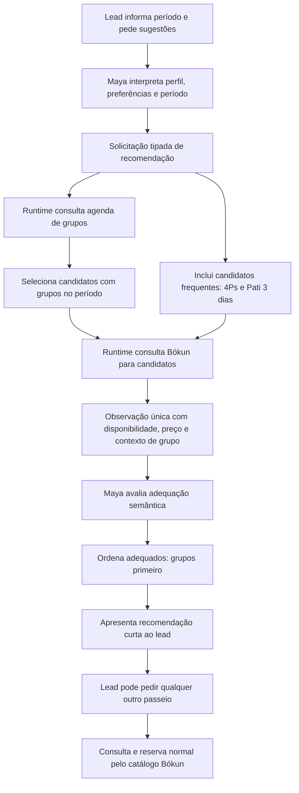

# Maya V2 — recomendações com prioridade comercial para grupos formados

**Data:** 2026-08-14
**Status:** aguardando revisão final de Carlos Eduardo

## Objetivo

Quando o lead informar o período em que estará em Lençóis ou na Chapada Diamantina e pedir recomendações de passeios, a Maya deve recomendar primeiro os passeios adequados ao perfil e às datas do lead. Entre os passeios adequados, deve dar prioridade comercial aos que já possuem grupo formado no período consultado.

A prioridade de recomendação não limita o catálogo, a consulta, a seleção nem a reserva. A Maya continua podendo consultar, recomendar, selecionar e reservar qualquer passeio válido no catálogo Bókun, com ou sem grupo formado.

## Regra central

A ordenação semântica é:

1. adequação ao perfil, preferências, composição do grupo e período do lead;
2. entre as opções adequadas, passeios com grupo formado no mesmo passeio e data;
3. como alternativas comerciais frequentes, roteiro 4Ps e Vale do Pati 3 dias quando compatíveis com o período e o perfil;
4. demais passeios adequados e disponíveis no Bókun.

Grupo formado é um sinal de prioridade, não uma condição geral de elegibilidade.

## Gatilho conversacional

O fluxo de recomendação deve ser usado quando o lead:

- informa datas ou um período de estadia na região; e
- pergunta quais passeios consegue fazer, quais são recomendados, solicita ajuda para montar um roteiro ou faz pergunta semanticamente equivalente.

A Maya continua sendo a única responsável por interpretar semanticamente a conversa. O controlador não usa palavras-chave, regex ou listas de frases para decidir a intenção do lead.

## Arquitetura

A Maya não recebe uma tool de planilha. O runtime continua responsável por compor os dados da fonte de grupos com os dados Bókun.

## Consulta de candidatos

Para evitar consultar o catálogo inteiro desnecessariamente, uma solicitação de recomendação por período consulta:

1. os passeios que possuem grupos formados em alguma data dentro do período informado;
2. o roteiro 4Ps;
3. o Vale do Pati 3 dias, quando houver janela contínua compatível no período;
4. candidatos adicionais que a Maya considere necessários para atender preferências explícitas do lead.

O conjunto acima é o conjunto inicial para recomendação, não uma lista fechada de passeios reserváveis.

Se o lead mencionar ou pedir outro passeio, o runtime deve permitir imediatamente a consulta normal desse produto, mesmo que:

- ele não tenha grupo formado;
- não seja 4Ps;
- não seja Vale do Pati 3 dias;
- não tenha aparecido na recomendação inicial.

## Critérios de adequação

A Maya avalia semanticamente, usando apenas fatos disponíveis, pelo menos:

- datas e quantidade de dias disponíveis;
- nível de esforço e dificuldade desejados;
- experiência e preferências declaradas;
- composição do grupo;
- duração do passeio;
- compatibilidade logística com o período;
- disponibilidade e dados atuais retornados pelo Bókun.

A existência de grupo não pode fazer um passeio claramente inadequado ultrapassar uma opção adequada. Entre duas ou mais opções adequadas, a existência de grupo determina prioridade comercial.

## Grupos formados

Um passeio somente pode ser apresentado como tendo grupo formado quando a observação autenticada retornar simultaneamente:

- `group_status = matched`;
- `existing_group = true`;
- mesma identidade canônica de passeio;
- mesma data recomendada.

A Maya pode explicar naturalmente que já existe grupo para aquela data. Não deve expor quantidade, nomes, linhas, comentários, guias ou qualquer conteúdo bruto da planilha além do contexto público aprovado.

Falha da fonte de grupos não impede a recomendação ou reserva geral de uma oferta válida no Bókun. Ela apenas remove a alegação e a prioridade de grupo para aquela opção.

## 4Ps e Vale do Pati 3 dias

4Ps e Vale do Pati 3 dias são alternativas comerciais frequentes, não produtos exclusivos nem obrigatórios.

- 4Ps pode ser sugerido quando for adequado às datas e ao perfil.
- Vale do Pati 3 dias só pode ser sugerido quando houver três dias contínuos compatíveis e o perfil do lead for adequado.
- A Maya não afirma que existe grupo ou saída confirmada para esses produtos sem evidência atual da fonte de grupos e do Bókun.
- A expressão comercial de que são passeios que “saem bastante” não substitui disponibilidade atual.

## Apresentação ao lead

Por padrão, a Maya apresenta uma recomendação curta, normalmente com até três opções:

1. melhor opção adequada, priorizando grupo formado;
2. segunda opção adequada, novamente priorizando grupo quando houver;
3. uma alternativa frequente ou outra opção adequada que complemente o roteiro.

A Maya pode apresentar mais opções quando a conversa justificar. O limite padrão é de comunicação, não de catálogo ou capacidade operacional.

## Não limitação de catálogo e reservas

Estas invariantes são obrigatórias:

1. Um passeio sem grupo formado continua consultável, recomendável, selecionável e reservável quando estiver disponível no Bókun.
2. Um passeio fora de 4Ps e Pati 3 dias continua consultável, recomendável, selecionável e reservável.
3. A ausência de grupo nunca bloqueia uma reserva normal que satisfaça as regras comerciais e operacionais do produto.
4. A prioridade de grupo não altera os contratos de `offer_id`, binding privado, confirmação ou execução de reserva.
5. O Bókun continua sendo a autoridade para disponibilidade, horário, preço, tarifa e binding executável.
6. A seleção de uma recomendação exige leitura fresca antes da reserva, como nos demais passeios.
7. A única exceção já existente é o subconjunto fechado de passeios com mínimo comercial de duas pessoas: para uma reserva de exatamente uma pessoa, a alternativa individual depende de grupo correspondente conforme a política publicada. Essa exceção não se generaliza para outras reservas.

## Falhas e comportamento degradado

| Situação | Recomendação | Consulta/reserva |
|---|---|---|
| Grupo encontrado e Bókun disponível | Priorizar entre os adequados | Fluxo normal |
| Sem grupo e Bókun disponível | Pode recomendar sem prioridade de grupo | Fluxo normal |
| Fonte de grupos indisponível e Bókun disponível | Recomendar sem afirmar grupo | Fluxo normal, exceto bypass solo mínimo-2 |
| Grupo encontrado e Bókun indisponível | Não apresentar como opção disponível | Não reservar |
| Passeio solicitado não estava nos candidatos iniciais | Consultar sob demanda | Fluxo normal |
| Grupo desaparece antes da reserva | Remover alegação/prioridade de grupo | Revalidar; reserva normal pode seguir se válida, salvo bypass solo mínimo-2 |

## Contrato com a Maya

A observação de recomendação deve fornecer apenas dados públicos e tipados necessários para raciocínio semântico, incluindo:

- produto e descrição pública;
- data e duração;
- disponibilidade e preço atuais;
- contexto fechado de grupo;
- informações públicas de dificuldade, logística e preparação quando consultadas;
- indicação de alternativa comercial frequente, quando aplicável.

A Maya decide adequação e redação. O runtime valida contratos e fatos de provider, mas não escolhe o “melhor passeio” por regra lexical nem reescreve a resposta.

## Testes de aceite

1. Período com dois passeios adequados, apenas um com grupo: a Maya recomenda primeiro o passeio com grupo.
2. Passeio com grupo claramente incompatível e passeio sem grupo adequado: a Maya recomenda primeiro o adequado sem grupo.
3. Nenhum grupo no período: a Maya ainda recomenda opções Bókun adequadas.
4. Fonte de grupos indisponível: opções normais continuam sendo recomendadas sem alegação de grupo.
5. Lead pede um passeio fora da recomendação inicial: a Maya consulta e pode reservar normalmente.
6. Lead pede explicitamente um passeio sem grupo: a Maya não tenta desviá-lo apenas por falta de grupo.
7. 4Ps adequado e sem grupo: pode ser recomendado como alternativa frequente, sem alegar grupo confirmado.
8. Pati 3 dias sem janela contínua: não é recomendado para aquele período.
9. Uma pessoa em produto mínimo-2 sem grupo: a alternativa individual permanece bloqueada pela política existente.
10. Duas ou mais pessoas no mesmo produto sem grupo: consulta e reserva normais continuam disponíveis pelo Bókun.
11. Seleção de qualquer passeio recomendado passa por leitura fresca e binding normal antes da reserva.
12. Uma conversa natural em formato ManyChat comprova a ordem de recomendação sem executar reserva, enviar mensagem real ou criar efeito externo durante a qualificação.

## Fora de escopo

- Limitar reservas aos passeios recomendados inicialmente.
- Tornar grupo formado requisito geral para reserva.
- Fazer 4Ps ou Pati 3 dias substituírem outros passeios adequados.
- Criar parser determinístico da fala do lead.
- Expor a planilha como tool para a Maya.
- Alterar regras da Maya V3.
- Executar reserva, pagamento ou envio ManyChat durante testes de qualificação sem autorização separada.
