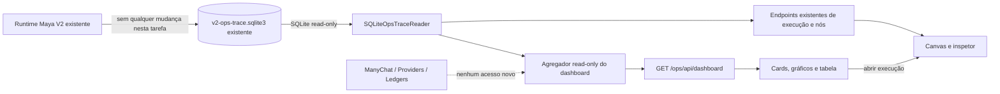

# Maya V2 — painel operacional com dados já existentes

**Data:** 2026-08-21

**Branch:** `feature/maya-ops-existing-data-dashboard`

**Worktree:** `/home/ubuntu/agente-v2/.worktrees/maya-ops-existing-data-dashboard`

**Base:** `acfd5d6c1f7ecfef2bebf875a8e5a4dac37da265`

**Destino pretendido após implementação e autorização separada:** `https://hermes.chapadabackpackers.com/ops`

## 1. Decisão aprovada

Evoluir a interface do `/ops` existente para um painel operacional inspirado no mockup visual aprovado, usando exclusivamente os dados que já existem no banco dedicado `v2-ops-trace.sqlite3` e nas respostas da API read-only atual.

Esta evolução é uma camada de leitura e cálculo. Ela não altera nem amplia:

- o comportamento, os textos ou as decisões da Maya;
- prompts, skills, tools, adapters ou contratos do agente;
- o ingresso ManyChat, reservas, pagamentos, handoffs ou entregas;
- os dados coletados ou persistidos;
- a instrumentação do runtime;
- os ledgers de negócio;
- qualquer provider ou efeito externo.

A interface nunca inventará campos, estados, eventos, granularidade comercial ou números. Quando um fato não estiver registrado, o componente será omitido ou mostrará `Não registrado`.

## 2. Abordagens consideradas

### 2.1 Evoluir o `/ops` atual — escolhida

Reutiliza login, sessão, API, atualização ao vivo, banco sanitizado e canvas já publicados. A tela principal passa a apresentar indicadores, gráficos e tabela operacional; o canvas permanece como detalhe de uma execução.

### 2.2 Criar `/ops/dashboard` separado — rejeitada

Duplicaria navegação, frontend e manutenção sem adicionar uma nova fonte confiável de dados.

### 2.3 Consultar o dashboard legado — rejeitada

Criaria acoplamento entre o V2 e o sistema legado, introduziria definições diferentes e quebraria o isolamento do V2. O painel novo não importará, consultará nem executará `/home/ubuntu/chapada-leads-hermes`.

## 3. Fonte de verdade e limite de evidência

A única fonte desta evolução é o banco Ops dedicado já produzido pelo V2:

```text
/data/ops/v2-ops-trace.sqlite3
├── executions
├── nodes
└── ops_schema
```

O serviço web continua abrindo esse banco em modo read-only por `SQLiteOpsTraceReader`. O navegador recebe apenas respostas JSON da API autenticada e nunca recebe caminhos, SQL, chaves de criptografia ou acesso aos bancos.

### 3.1 Campos de execução existentes

- `execution_id`;
- `lead_id`;
- `received_at`;
- `completed_at`;
- `status` e visão derivada de `running_stale`;
- `trace_completeness`;
- `current_node_id`;
- `terminal_reason`.

### 3.2 Campos de nó existentes

- `node_id` e `execution_id`;
- `node_type`;
- `ordinal`, `attempt` e `parent_node_id`;
- `status`;
- `started_at` e `completed_at`;
- `input_summary` e `output_summary`;
- presença de input/output completo já persistido;
- `error` sanitizado;
- `technical_metadata`.

### 3.3 Regra de evidência

Um indicador só pode afirmar:

1. uma contagem direta de execuções ou nós;
2. uma distinção de `lead_id`;
3. uma duração calculada entre dois timestamps existentes;
4. uma classificação baseada em enum ou `node_type` fechado já persistido;
5. uma proporção cujo numerador e denominador estejam definidos nesta especificação.

O painel não interpreta `input_summary`, `output_summary`, erros ou texto para deduzir intenção, produto, etapa comercial, receita, confirmação, satisfação ou motivo de handoff.

## 4. Períodos e conjunto-base

A interface oferece períodos móveis, evitando introduzir configuração de timezone ou semântica de calendário inexistente:

- `Últimas 24 horas`;
- `Últimos 7 dias`;
- `Últimos 30 dias`.

Para um instante de consulta `now` em UTC e duração `D`, o conjunto-base é:

```text
E(D) = execuções com received_at >= now - D e received_at <= now
```

Todos os cards e gráficos do período usam o mesmo `E(D)`, salvo indicação explícita. Os limites são inclusivos. Timestamps inválidos ou incoerentes já são falhas do store/API e não serão corrigidos pela UI.

A API calcula um único `generated_at` por resposta para que todos os resultados da mesma consulta compartilhem o mesmo corte temporal.

## 5. Indicadores permitidos e fórmulas

| Indicador | Fórmula exata | Observação exibida |
|---|---|---|
| Execuções | `count(E(D))` | Uma execução corresponde a um evento/mensagem recebido pelo V2. |
| Leads distintos | `count(distinct lead_id em E(D))` | Não equivale a novos leads. |
| Em andamento | execuções em `E(D)` cuja visão atual é `pending`, `running` ou `running_stale` | `running_stale` permanece identificável no detalhe. |
| Concluídas | execuções em `E(D)` com visão atual `completed` | É conclusão técnica, não conversão comercial. |
| Falhas | execuções em `E(D)` com visão atual `failed` | Não deduz causa comercial. |
| Revisão manual | execuções em `E(D)` com visão atual `manual_review` | Não equivale necessariamente a handoff. |
| Taxa técnica de conclusão | `concluídas / count(E(D)) * 100` | Se `E(D)` estiver vazio, exibir `—`, nunca `0%`. |
| Duração média terminal | média de `completed_at - received_at` das execuções terminais em `E(D)` com ambos timestamps | Universo terminal: `completed`, `failed`, `manual_review`. Exibir `—` sem amostra. |
| Com marco de reserva | execuções distintas em `E(D)` com ao menos um nó de reserva definido em 5.1 | Não usar o rótulo “reservas confirmadas”. |
| Com marco de pagamento | execuções distintas em `E(D)` com ao menos um nó de pagamento definido em 5.2 | Não afirmar pagamento pago ou valor. |
| Com entrega pública | execuções distintas em `E(D)` com ao menos um nó de entrega definido em 5.3 | Não inferir leitura pelo lead. |
| Com handoff | execuções distintas em `E(D)` com ao menos um nó de handoff definido em 5.4 | Não inferir motivo. |

Contagens de marcos são por execução distinta, não por quantidade de nós. Assim, retries e várias etapas Stripe não inflacionam o número de execuções afetadas.

### 5.1 Nós que comprovam marco de reserva

- `cloudbeds_reservation_request`;
- `cloudbeds_reservation_response`;
- `bokun_booking_request`;
- `bokun_booking_response`;
- `ledger_reservation`.

### 5.2 Nós que comprovam marco de pagamento

- `stripe_product`;
- `stripe_price`;
- `stripe_payment_link`;
- `pix_instruction`;
- `wise_instruction`;
- `settlement`;
- `stripe_reconciliation`;
- `ledger_payment`.

### 5.3 Nós que comprovam marco de entrega pública

- `public_outbox`;
- `manychat_delivery_request`;
- `manychat_delivery_response`;
- `ledger_public_outbox`.

### 5.4 Nós que comprovam marco de handoff

- `handoff_request`;
- `handoff_delivery`.

## 6. Gráficos permitidos

### 6.1 Execuções ao longo do período

- agrupar `E(D)` por intervalos UTC;
- últimas 24 horas: 24 baldes horários;
- últimos 7 dias: 7 baldes móveis de 24 horas;
- últimos 30 dias: 30 baldes móveis de 24 horas;
- baldes sem execução aparecem com zero;
- o gráfico representa execuções, não leads distintos.

### 6.2 Distribuição por estado atual

Contagem de execuções em `E(D)` nas categorias fechadas:

- `pending`;
- `running`;
- `running_stale`;
- `completed`;
- `failed`;
- `manual_review`.

### 6.3 Completude do trace

Contagem de execuções em `E(D)` por:

- `complete_trace`;
- `partial_trace`;
- `ledger_only`.

### 6.4 Marcos operacionais

Quatro barras, cada uma contando execuções distintas em `E(D)`:

- com reserva;
- com pagamento;
- com entrega pública;
- com handoff.

As categorias podem se sobrepor e não formam um funil.

### 6.5 Tipos de nó mais frequentes

Contagem direta dos `node_type` pertencentes às execuções de `E(D)`, limitada aos dez mais frequentes. O título explicita `Nós registrados`, não `Ações comerciais`.

## 7. Interface

O painel aproveita a linguagem visual do mockup aprovado — verde, areia, cartões, tipografia, responsividade e drawer — mas substitui todo conteúdo demonstrativo por dados reais da API.

### 7.1 Navegação

A aplicação continua em `/ops/` e possui duas visões internas, sem novas rotas de serviço:

- `Visão geral`: indicadores, gráficos e tabela;
- `Execução`: canvas e inspetor já existentes.

O logout e o estado de conexão permanecem disponíveis. A interface continua explicitamente marcada como `SOMENTE LEITURA`.

### 7.2 Visão geral

Ordem:

1. seletor de período;
2. indicador de conexão e instante de atualização;
3. oito cards primários: execuções, leads distintos, em andamento, concluídas, falhas, revisão manual, taxa técnica de conclusão e duração média terminal;
4. gráficos permitidos; os quatro marcos operacionais aparecem no gráfico próprio, sem ampliar o topo para doze cards;
5. tabela de execuções.

Os valores de marcos continuam presentes no payload da API para alimentar o gráfico e os indicadores booleanos da tabela. Em bases pequenas ou vazias, o layout continua válido. Não são inseridos exemplos para “encher” gráficos.

### 7.3 Tabela de execuções

Cada linha pode mostrar somente:

- `lead_id`;
- `execution_id` abreviado visualmente, com valor completo acessível;
- `received_at`;
- duração, quando calculável;
- estado atual;
- completude do trace;
- tipo do nó atual, obtido pela associação com `current_node_id` quando registrado;
- quantidade total de nós;
- indicadores booleanos de presença de reserva, pagamento, entrega pública e handoff;
- `terminal_reason`, quando existente.

Filtros permitidos:

- busca exata por Lead ID, preservando o contrato atual;
- estado;
- completude do trace;
- período.

### 7.4 Detalhe da execução

Ao abrir uma linha, a interface carrega os nós reais e apresenta:

- canvas estilo n8n;
- estado, ordinal e tentativa de cada nó;
- input e output resumidos simultaneamente;
- erro sanitizado e metadados existentes;
- conteúdo completo somente se já estiver persistido e permitido;
- retorno à visão geral sem perder período e filtros.

O painel não adiciona replay, retry, reserva, pagamento, mensagem, handoff, edição ou qualquer outra ação operacional.

## 8. API read-only

Os endpoints existentes permanecem compatíveis:

```text
GET /ops/api/executions
GET /ops/api/executions/{execution_id}
GET /ops/api/executions/{execution_id}/nodes
GET /ops/api/executions/{execution_id}/nodes/{node_id}/full
GET /ops/api/events
GET /ops/api/harness
GET /ops/api/release
```

Será adicionado um endpoint autenticado e somente leitura:

```text
GET /ops/api/dashboard?range=24h|7d|30d
```

Resposta conceitual:

```json
{
  "generated_at": "timestamp UTC",
  "range": "7d",
  "metrics": {},
  "execution_series": [],
  "status_distribution": [],
  "trace_distribution": [],
  "milestones": [],
  "top_node_types": [],
  "executions": []
}
```

A resposta é calculada do snapshot lógico do `SQLiteOpsTraceReader`, recebe ETag e não persiste cache, agregados ou novos eventos. A implementação deve usar consultas limitadas/agregadas no reader; não deve depender de baixar todo o banco no navegador.

`range` fora do conjunto fechado retorna `422 invalid_query`. Nenhum parâmetro aceita SQL, nome de coluna ou expressão arbitrária.

## 9. Estados de erro e ausência

| Situação | Comportamento |
|---|---|
| Base sem execuções no período | Cards de contagem mostram `0`; taxas e médias mostram `—`; gráficos ficam zerados; tabela apresenta estado vazio. |
| Campo ou nó não registrado | Mostrar `Não registrado` ou omitir o detalhe; nunca fabricar valor. |
| Banco indisponível/incompatível | API retorna `503 source_unavailable`; UI preserva o último snapshot e mostra aviso de desconexão. |
| Sessão ausente/expirada | API retorna `401`; interface volta ao login. |
| Poll/SSE interrompido | Marcar `Desconectado`; não apagar o último snapshot. |
| Execução `running_stale` | Mostrar explicitamente como atrasada; não convertê-la em falha ou sucesso. |
| Conteúdo completo ausente | Manter o resumo e mostrar `Não registrado`. |
| Duração negativa ou timestamp incoerente | Falha fechada no backend/store; não corrigir ou ocultar silenciosamente na UI. |

## 10. Conteúdo expressamente excluído

Esta versão não mostra nem calcula:

- receita potencial, receita realizada, ticket médio ou valores financeiros;
- taxa de conversão comercial;
- novos leads, qualificados, opção escolhida ou funil comercial;
- interesse em passeio, hospedagem ou pacote;
- intenção, sentimento, satisfação ou qualidade da conversa;
- etapa comercial inferida;
- motivo de handoff inferido;
- reserva confirmada quando há apenas um marco técnico;
- pagamento pago quando há apenas um marco técnico;
- conversa completa quando ela não está registrada no Ops;
- comparações ou tendências contra período anterior;
- nomes, telefones, e-mails ou outros campos que não fazem parte do contrato Ops atual.

Não haverá placeholders, números demonstrativos ou fallback para o sistema legado.

## 11. Arquitetura e fluxo



O agregador não escreve no banco, não acessa providers, não importa o legado e não chama o runtime da Maya.

## 12. Estratégia de testes

### 12.1 Contratos de agregação

Testes criam um SQLite Ops temporário por meio do writer real e comprovam:

- corte inclusivo para `24h`, `7d` e `30d`;
- uso de `received_at` como critério do período;
- leads distintos;
- cada estado atual, incluindo `running_stale`;
- taxa com base vazia e não vazia;
- duração média somente para terminais com timestamps válidos;
- deduplicação de vários nós/retries na mesma execução;
- conjuntos fechados de reserva, pagamento, entrega e handoff;
- sobreposição legítima de marcos;
- distribuição de completude;
- baldes temporais zerados;
- ranking dos tipos de nós.

### 12.2 API

- login obrigatório;
- `range` fechado e erro `422`;
- payload sem campos fictícios ou comerciais;
- ETag/304;
- `503` sanitizado quando a fonte falha;
- métodos de escrita ausentes;
- endpoints antigos permanecem compatíveis.

### 12.3 UI

- cards e gráficos renderizam exclusivamente o payload;
- base vazia não cria exemplos;
- filtros e períodos funcionam;
- tabela desktop e cartões mobile;
- clique abre canvas com nós reais;
- retorno preserva filtros;
- input/output permanecem simultâneos;
- nenhum uso de `innerHTML` com dados da API;
- nenhum botão ou request de escrita;
- estados `401`, `503`, desconectado e `Não registrado`;
- layout sem overflow nos tamanhos desktop e mobile definidos pelo mockup.

### 12.4 Não regressão e ausência de efeitos

- suíte `tests/test_v2_ops_*.py`;
- testes focados do agregador e frontend;
- scanner de fronteiras/dependências;
- busca estática por métodos de escrita ou endpoints de efeito no frontend;
- banco Ops comparado antes/depois de chamadas GET para provar ausência de mutação;
- nenhum teste usa provider real, ManyChat real, reserva, pagamento ou handoff.

## 13. Critérios de aceite

A implementação futura será aceita somente quando:

1. `/ops/` mostrar a visão geral com o visual aprovado e dados exclusivamente do banco Ops real;
2. os períodos móveis e todas as fórmulas corresponderem a esta especificação;
3. nenhuma métrica comercial ou fictícia aparecer;
4. uma base vazia permanecer vazia, sem dataset demonstrativo;
5. a tabela abrir o canvas real da execução;
6. o canvas e o inspetor atuais continuarem funcionais;
7. login, logout, sessão, ETag e atualização ao vivo permanecerem funcionais;
8. a API e a UI continuarem estritamente read-only;
9. testes demonstrarem que retries/nós múltiplos não inflam contagens por execução;
10. o agente, sua instrumentação e seus efeitos permanecerem byte a byte fora do diff desta tarefa;
11. o sistema legado e o Agente V3 permanecerem fora do diff e do runtime do painel;
12. a suite afetada e os smokes read-only passarem sem efeitos externos.

## 14. Limites desta autorização

A aprovação deste desenho autoriza documentar e planejar a evolução do painel. Ela não autoriza deploy, restart, alteração do agente, nova instrumentação, provider write, reserva, pagamento, entrega ManyChat, handoff ou mudança no V3.

Qualquer publicação em produção será uma decisão separada, depois de implementação, testes e revisão do diff exato.
