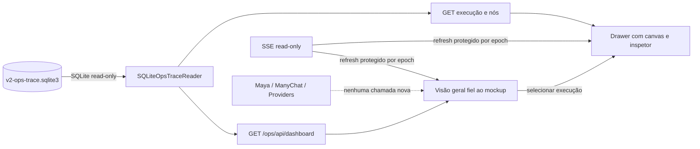

# Maya Ops — redesenho de alta fidelidade ao mockup com dados existentes

**Data:** 2026-08-22

**Branch:** `feature/maya-ops-existing-data-dashboard`

**Referência visual canônica:** `/home/ubuntu/maya-dashboard-mockup`

**Superfície publicada:** `https://hermes.chapadabackpackers.com/ops`

## 1. Decisão aprovada

Reconstruir a composição visual do Maya Ops para reproduzir, com alta fidelidade, o layout e o acabamento do mockup aprovado. A interface continuará usando exclusivamente fatos existentes no `v2-ops-trace.sqlite3` e cálculos determinísticos já definidos no contrato do dashboard.

A fidelidade desejada não se limita à paleta. Ela abrange:

- arquitetura visual da página;
- sidebar, cabeçalho e hierarquia vertical;
- densidade e acabamento dos cards;
- organização e proporção dos módulos analíticos;
- refinamento da tabela operacional;
- drawer lateral de detalhe;
- tipografia, espaçamento, bordas, sombras, ícones e estados;
- comportamento responsivo desktop e mobile.

Nenhuma lacuna de dados será preenchida com conteúdo demonstrativo, inferência comercial ou placeholder numérico. Quando um módulo do mockup não possuir sustentação no banco Ops, ele será omitido ou substituído por uma visualização equivalente que represente dados existentes.

## 2. Problema observado

A versão atualmente publicada incorporou cores e alguns padrões superficiais do mockup, mas preservou uma composição técnica simplificada. As diferenças concretas são:

- sidebar reduzida e sem o lockup, agrupamento, ícones, acabamento e rodapé operacional do mockup;
- cabeçalho sem a mesma estrutura, densidade ou clareza executiva;
- ausência do bloco de abertura e do indicador de saúde visualmente destacado;
- KPIs sem ícones, contexto visual, micrográficos e hierarquia tipográfica equivalente;
- gráficos pequenos, pouco densos e sem a composição de painéis do mockup;
- tabela com aparência de saída técnica, em vez de superfície operacional refinada;
- detalhe que substitui a página, em vez de preservar o contexto por meio de drawer;
- espaçamento, escala, sombras, bordas e responsividade aquém da referência.

O objetivo desta etapa é corrigir essa diferença de produto sem mudar a fonte, o significado ou a disponibilidade dos dados.

## 3. Abordagens consideradas

### 3.1 Transposição fiel do sistema visual — escolhida

Usar o mockup como fonte canônica de composição e componentes, substituindo seu dataset sintético pelo payload real já autorizado. Esta abordagem maximiza fidelidade e reaproveita decisões visuais já aprovadas.

### 3.2 Aplicar somente um novo tema à estrutura atual — rejeitada

Mudanças apenas em cores, tipografia e bordas não resolvem as diferenças de hierarquia, navegação, densidade, tabela e detalhe.

### 3.3 Reconstruir um design sem usar o mockup — rejeitada

Criaria novas decisões visuais desnecessárias e aumentaria o risco de novo desalinhamento com a referência escolhida pelo usuário.

## 4. Fonte canônica e precedência

A implementação deverá seguir esta ordem de precedência:

1. **Contrato de dados e segurança:** `docs/superpowers/specs/2026-08-21-maya-ops-existing-data-dashboard-design.md`.
2. **Composição visual:** screenshot desktop e arquivos da referência em `/home/ubuntu/maya-dashboard-mockup`.
3. **Comportamento real já validado:** API, SSE, filtros, canvas, Input/Output e proteção contra races do Maya Ops publicado.
4. **Detalhes não definidos:** padrões acessíveis e responsivos existentes no código, sem inventar conteúdo.

A referência visual fornece aparência e interação, mas não autoriza importar:

- dataset demonstrativo;
- KPIs comerciais;
- funil comercial;
- interesse em passeio, hospedagem ou pacote;
- receita, conversão, tendências ou comparações;
- conversa fictícia;
- próximo passo inferido;
- motivos de handoff inferidos;
- rotas ou ações de efeito.

## 5. Limites funcionais preservados

Esta etapa não modifica:

- Maya, prompts, skills, tools ou comportamento do agente;
- ManyChat, reservas, pagamentos, handoffs ou providers;
- runtime, instrumentação, schema, writer ou dados coletados;
- API e fórmulas do dashboard, salvo ajuste estritamente necessário para apresentação já sustentada pelo contrato;
- autenticação, sessão, ETag, SSE ou política de conteúdo completo;
- Agente V3 ou dashboard legado.

A aplicação permanece autenticada, somente leitura e sem superfície operacional de escrita.

## 6. Arquitetura visual

### 6.1 Shell desktop

O desktop terá a composição estrutural do mockup:

```text
┌──────────────────────┬──────────────────────────────────────────────┐
│ Sidebar fixa         │ Cabeçalho translúcido                       │
│ Maya Ops             ├──────────────────────────────────────────────┤
│ Somente leitura      │ Abertura + estado de atualização             │
│                      ├──────────────────────────────────────────────┤
│ Visão geral          │ 8 KPIs em grade 4 × 2                        │
│ Execuções            ├──────────────────────────────────────────────┤
│                      │ Analytics em grade assimétrica               │
│ Saúde da fonte       ├──────────────────────────────────────────────┤
│ Fonte read-only      │ Operações recentes + filtros + tabela        │
└──────────────────────┴──────────────────────────────────────────────┘
```

A largura, proporção, espaçamento e contraste deverão acompanhar a referência. O conteúdo principal usa fundo areia claro; cards e painéis usam superfície marfim; a sidebar permanece verde-floresta.

### 6.2 Sidebar

A sidebar reproduzirá os padrões do mockup:

- lockup `Maya Ops` com marca compacta;
- subtítulo operacional;
- badge `SOMENTE LEITURA`, substituindo o badge demonstrativo;
- rótulo de grupo de navegação;
- itens com ícone, texto, estado ativo e marcador coral;
- rodapé com estado da fonte ao vivo e nota de leitura.

Somente dois destinos funcionais serão exibidos:

- `Visão geral`;
- `Execuções`.

Não serão mostrados itens sem uma visão real, como Reservas, Pagamentos, Integrações ou Configurações. A sidebar não simulará rotas inexistentes.

### 6.3 Cabeçalho

O cabeçalho seguirá a estrutura do mockup:

- menu móvel quando aplicável;
- eyebrow `OPERAÇÃO MAYA V2`;
- título `Painel operacional`;
- subtítulo curto, factual e sem promessa comercial;
- seletor de período `24h`, `7d` e `30d`;
- controle de atualização manual read-only;
- indicador de atualização ao vivo;
- identificação compacta do operador;
- logout dentro do menu/controle do operador, sem competir visualmente com os dados.

O estado SSE não será descrito como “Maya online”. O texto deve representar apenas o que a aplicação sabe, por exemplo `Atualização ao vivo conectada` ou `Atualização desconectada`.

### 6.4 Abertura

Abaixo do cabeçalho haverá um bloco de abertura inspirado na `welcome-row` do mockup:

- título contextual curto;
- descrição do conjunto exibido;
- health pill derivado exclusivamente da conectividade da API/SSE;
- instante `generated_at` do snapshot atual.

Não haverá saudação personalizada, horário inferido ou estado de saúde do agente que não esteja comprovado pela superfície atual.

## 7. KPIs reais com acabamento do mockup

Os oito KPIs permanecem exatamente os já autorizados:

1. Execuções;
2. Leads distintos;
3. Em andamento;
4. Concluídas;
5. Falhas;
6. Revisão manual;
7. Conclusão técnica;
8. Duração média terminal.

Cada card terá:

- ícone local ou SVG inline decorativo e acessível;
- rótulo;
- valor principal com números tabulares;
- nota contextual factual;
- micrográfico somente quando puder ser derivado da série de execuções do período;
- estado visual coerente com o dado, sem inferência qualitativa.

### 7.1 Micrográficos

Micrográficos podem representar exclusivamente os baldes da `execution_series` atual. Quando um KPI não possui série própria, o card pode:

- usar a série geral como contexto explicitamente rotulado `Execuções no período`; ou
- omitir o micrográfico e preservar a composição com uma nota factual.

Nunca serão desenhadas tendências contra período anterior, setas de crescimento ou percentuais comparativos sem dados correspondentes.

### 7.2 Semântica de cor

- verde: conclusão técnica ou conectividade confirmada;
- azul-petróleo: andamento ou informação;
- mostarda: revisão/atenção não terminal;
- coral: destaque de navegação ou handoff registrado;
- vermelho-terra: falha registrada;
- neutro: ausência, zero ou não registrado.

Cor nunca será o único sinal.

## 8. Analytics adaptado aos dados reais

A grade deverá reproduzir a densidade e a proporção do mockup, mas seus módulos serão:

### 8.1 Execuções no período

Painel principal, equivalente visual ao gráfico de volume do mockup:

- linha/área SVG;
- grade, marcadores e rótulos temporais;
- tooltip ou título acessível com timestamp e contagem;
- zero explícito para baldes vazios.

### 8.2 Estados atuais

Painel de distribuição com composição de donut e legenda textual, usando apenas:

- pending;
- running;
- running_stale;
- completed;
- failed;
- manual_review.

O centro do donut mostra o total de execuções no período, não uma métrica comercial.

### 8.3 Completude do trace

Painel compacto em barras ou donut, conforme melhor preservar a composição:

- complete_trace;
- partial_trace;
- ledger_only.

### 8.4 Marcos registrados

Barras horizontais refinadas para:

- reserva;
- pagamento;
- entrega pública;
- handoff.

O título e a descrição devem declarar que são marcos técnicos registrados e categorias sobrepostas, não um funil.

### 8.5 Nós registrados

Ranking horizontal dos tipos de nó mais frequentes, limitado ao payload existente. Rótulos técnicos serão formatados para leitura sem alterar o valor subjacente.

### 8.6 Composição da grade

No desktop:

- primeira faixa: gráfico de execuções ocupando a coluna maior e estados atuais na coluna menor;
- segunda faixa: completude, marcos e nós organizados para preservar ritmo visual e alturas equilibradas;
- painéis com heading, meta contextual, legenda e estado vazio próprios.

Nenhum painel vazio será preenchido com dados fictícios. Estados vazios devem continuar visualmente intencionais e bem compostos.

## 9. Tabela operacional

A seção seguirá o acabamento da tabela do mockup:

- cabeçalho de seção com título, descrição e badge de atualização ao vivo;
- toolbar integrada em superfície levemente contrastante;
- busca de Lead ID;
- filtros de estado e completude;
- contador de resultados;
- cabeçalhos compactos em caixa alta;
- linhas com hover, foco e seleção;
- badges consistentes;
- botão explícito para abrir detalhe;
- truncamento visual com conteúdo completo acessível quando necessário.

### 9.1 Colunas desktop

A tabela continuará limitada aos campos reais:

- Lead;
- Execução;
- Recebida;
- Duração;
- Estado;
- Trace;
- Nó atual;
- Nós;
- Marcos;
- Motivo terminal;
- controle de detalhe.

A hierarquia visual pode combinar identificador primário e secundário dentro da mesma célula, mas não remove acesso aos valores existentes.

### 9.2 Mobile

Abaixo de `720px`:

- a tabela deixa de ser exibida;
- cada execução vira um card selecionável;
- estado, trace, horário e marcos permanecem visíveis;
- busca, filtros e contador são reorganizados verticalmente;
- não há overflow horizontal no documento.

## 10. Drawer de execução

Selecionar uma execução abrirá um drawer lateral sobre a visão geral. A página ao fundo permanece visível para preservar contexto.

### 10.1 Cabeçalho do drawer

- identificação abreviada da execução;
- Lead ID conforme contrato atual;
- badges de estado e completude;
- botão de fechar;
- fechamento por Escape e backdrop;
- restauração de foco no acionador original.

### 10.2 Resumo factual

O drawer pode mostrar somente fatos presentes no payload:

- recebido em;
- concluído em ou duração;
- nó atual;
- quantidade de nós;
- motivo terminal;
- marcos registrados.

Não haverá resumo semântico da conversa, próximo passo sugerido ou razão inferida.

### 10.3 Canvas e inspetor

O drawer incorpora o detalhe técnico já validado:

- canvas estilo n8n;
- edges e nodes reais;
- zoom in/out e Fit;
- seleção de nó;
- Input e Output resumidos simultaneamente;
- conteúdo completo permitido sob ação explícita;
- metadados técnicos;
- erro sanitizado.

No desktop, o drawer pode ser mais largo que o mockup original para acomodar canvas e inspetor, usando `min(960px, 92vw)` como referência. Internamente:

- canvas ocupa a região principal;
- inspetor ocupa coluna lateral;
- ambos possuem scroll delimitado;
- o documento ao fundo não rola enquanto o drawer está aberto.

Em tablet/mobile, o drawer ocupa a viewport e canvas/inspetor empilham verticalmente.

### 10.4 Concorrência e atualização

As garantias atuais permanecem:

- refresh atual limpa detalhe obsoleto antes do `await`;
- resposta superseded não altera a interface atual;
- troca de execução ou nó invalida full requests antigos;
- Input e Output possuem epochs independentes;
- 503 ou falha de rede não deixam dados antigos apresentados como atuais.

## 11. Tokens visuais

Os tokens canônicos da referência são preservados:

| Token | Valor |
|---|---:|
| `brand-700` | `#245634` |
| `brand-800` | `#173A27` |
| `brand-600` | `#005A2A` |
| `sand-100` | `#F4E8D7` |
| `ivory-50` | `#FFFCF7` |
| `sand-300` | `#E4D5C0` |
| `text-muted` | `#66766B` |
| `coral-500` | `#E85F67` |
| `success-500` | `#2F7D4A` |
| `info-500` | `#327E8F` |
| `warning-500` | `#C99135` |
| `danger-600` | `#B7443E` |
| `neutral-500` | `#A99C8A` |

Outras regras:

- sidebar desktop próxima de `248px`;
- cards com raio de `16px`;
- bordas quentes de 1px;
- sombras suaves e restritas a painéis principais;
- serif local apenas em títulos de destaque;
- sans-serif de sistema no restante;
- números tabulares;
- `focus-visible` de alto contraste;
- animação discreta e desativável por `prefers-reduced-motion`.

## 12. Responsividade

### Desktop — `1440 × 1000`

Superfície primária de aprovação:

- sidebar fixa;
- grade KPI `4 × 2`;
- analytics em múltiplas colunas;
- tabela completa;
- drawer lateral amplo;
- sem clipping ou overflow horizontal do documento.

### Tablet — até `1100px`

- sidebar reduzida ou colapsável;
- KPIs em duas colunas;
- analytics reorganizado;
- drawer sobreposto;
- controles secundários compactados.

### Mobile — `390 × 844`

- sidebar vira menu off-canvas;
- cabeçalho compacto;
- KPIs em duas colunas quando legíveis;
- analytics empilhado;
- tabela substituída por cards;
- drawer em tela cheia;
- canvas e inspetor empilhados;
- touch targets mínimos adequados;
- nenhum overflow horizontal do documento.

## 13. Acessibilidade e DOM seguro

- HTML semântico e landmarks claros;
- labels visíveis ou acessíveis em todos os controles;
- foco preservado ao abrir/fechar drawer;
- navegação por teclado no canvas e nos controles;
- estados anunciados por `aria-live` sem excesso;
- contraste compatível com leitura operacional;
- gráficos com rótulos textuais, não apenas cor;
- DOM criado com APIs seguras;
- nenhum `innerHTML` com dados da API;
- allowlist atual de controles e tipos efetivos preservada ou atualizada de forma fechada.

## 14. Estados de carregamento e erro

| Estado | Apresentação |
|---|---|
| Carregamento inicial | Skeletons ou placeholders estruturais sem números falsos. |
| Base vazia | KPIs reais em zero/`—`, gráficos vazios intencionais e estado vazio na lista. |
| SSE conectado | Badge factual de atualização ao vivo. |
| SSE desconectado | Badge/aviso de desconexão, mantendo último snapshot identificado. |
| API `503` | Aviso sanitizado; não preencher dados; detalhe atual é limpo conforme contrato de race. |
| Sessão expirada | Redirecionamento para login. |
| Conteúdo full ausente | Resumo preservado e indicação `Não registrado`. |
| Execução superseded | Nenhuma atualização visual proveniente da resposta antiga. |

## 15. Arquivos previstos

A implementação deverá permanecer concentrada em:

- `v2_ops/static/index.html`;
- `v2_ops/static/ops.css`;
- `v2_ops/static/ops.js`;
- `tests/test_v2_ops_ui.py`;
- `tests/browser/ops_dashboard_smoke.py`;
- documentação de verificação estritamente necessária.

Alteração de backend/API não é esperada. Se durante o planejamento for identificada uma necessidade real, ela deverá ser justificada contra o payload atual antes de entrar no plano.

## 16. Estratégia de testes

### 16.1 Contrato visual estático

Testes devem comprovar:

- estrutura equivalente ao mockup: sidebar, cabeçalho, abertura, KPIs, analytics, operações e drawer;
- presença dos tokens canônicos;
- somente itens de navegação reais;
- ausência de labels demonstrativas e métricas excluídas;
- ausência de controles de efeito;
- DOM seguro e allowlist fechada;
- breakpoints desktop/tablet/mobile.

### 16.2 Comportamento frontend

Chromium real deve cobrir:

- login e carregamento inicial;
- 8 KPIs a partir do payload;
- períodos `24h`, `7d` e `30d`;
- busca e filtros;
- abertura/fechamento do drawer por botão, Escape e backdrop;
- foco restaurado;
- carregamento do canvas e seleção de nó;
- Input e Output resumidos;
- full requests concorrentes nas duas ordens;
- refresh manual e SSE;
- respostas superseded;
- 503 e erro de rede;
- base vazia sem dados demonstrativos.

### 16.3 Regressão read-only

- todos os testes `test_v2_ops_*`;
- comparação de DB/WAL/SHM antes e depois dos GETs e browser smoke;
- nenhuma rota PUT/PATCH/DELETE;
- POST somente login/logout;
- nenhum provider ou efeito externo;
- nenhum diff em agente, runtime, instrumentação, schema ou writer.

### 16.4 Qualificação visual

Gerar e inspecionar screenshots em:

- `1440 × 1000`;
- `390 × 844`;
- drawer desktop aberto;
- drawer mobile aberto.

A qualificação deve comparar a implementação real com `/home/ubuntu/maya-dashboard-mockup/artifacts/dashboard-desktop.png` e registrar diferenças intencionais causadas pela indisponibilidade de dados comerciais.

## 17. Critérios de fidelidade visual

A implementação será aceita visualmente apenas quando:

1. a primeira impressão reproduzir a arquitetura do mockup, e não apenas suas cores;
2. sidebar, cabeçalho, abertura, grade KPI, painéis e tabela apresentarem proporções equivalentes;
3. cards incluírem ícones, hierarquia tipográfica e contexto factual;
4. analytics tiver densidade e acabamento comparáveis à referência;
5. a tabela parecer uma superfície operacional, com toolbar, badges e seleção refinados;
6. o detalhe abrir em drawer e preservar a visão geral ao fundo;
7. desktop e mobile não apresentarem clipping, overflow ou elementos técnicos sem acabamento;
8. estados vazios e de erro parecerem componentes intencionais;
9. diferenças em relação ao mockup decorrerem de restrição de dados, não de simplificação visual não justificada.

Não é necessário reproduzir pixel a pixel conteúdo que não existe. É necessário reproduzir com alta fidelidade o sistema de layout, densidade, ritmo e componentes.

## 18. Critérios funcionais de aceite

1. Todos os números e rótulos variáveis vêm do payload autenticado atual.
2. Nenhum dado demonstrativo entra na versão real.
3. Nenhum módulo afirma receita, conversão, interesse, etapa comercial ou motivo inferido.
4. Os períodos e filtros atuais permanecem corretos.
5. SSE e refresh preservam as proteções contra races.
6. Canvas, zoom, Fit, Input, Output, metadados e erro continuam funcionais.
7. Full content continua explícito e limitado ao conteúdo já persistido e autorizado.
8. A interface permanece estritamente read-only.
9. O banco permanece inalterado pelos testes e pela navegação.
10. Chromium real passa sem skip em desktop e mobile.
11. A suíte completa afetada passa.
12. Revisão independente do diff não encontra achado crítico, importante ou menor não aceito.

## 19. Fluxo de dados preservado



## 20. Publicação e rollback

A implementação e a publicação são etapas separadas:

1. implementar em branch/worktree isolada;
2. executar testes e qualificação visual;
3. revisar o diff integral;
4. apresentar evidência e solicitar autorização de publicação;
5. construir imagem imutável;
6. executar dark smoke autenticado;
7. publicar com rollback preparado;
8. validar health, release, dashboard, browser e invariância do banco.

A aprovação desta especificação não autoriza automaticamente novo deploy. A versão atualmente publicada permanece como rollback até a promoção explícita do redesenho.

## 21. Entregável esperado

O resultado deve ser reconhecível como a versão real do mockup aprovado: mesma linguagem de produto, mesma qualidade de composição e mesmos padrões de interação, mas alimentado exclusivamente pelas evidências operacionais existentes no Maya V2.