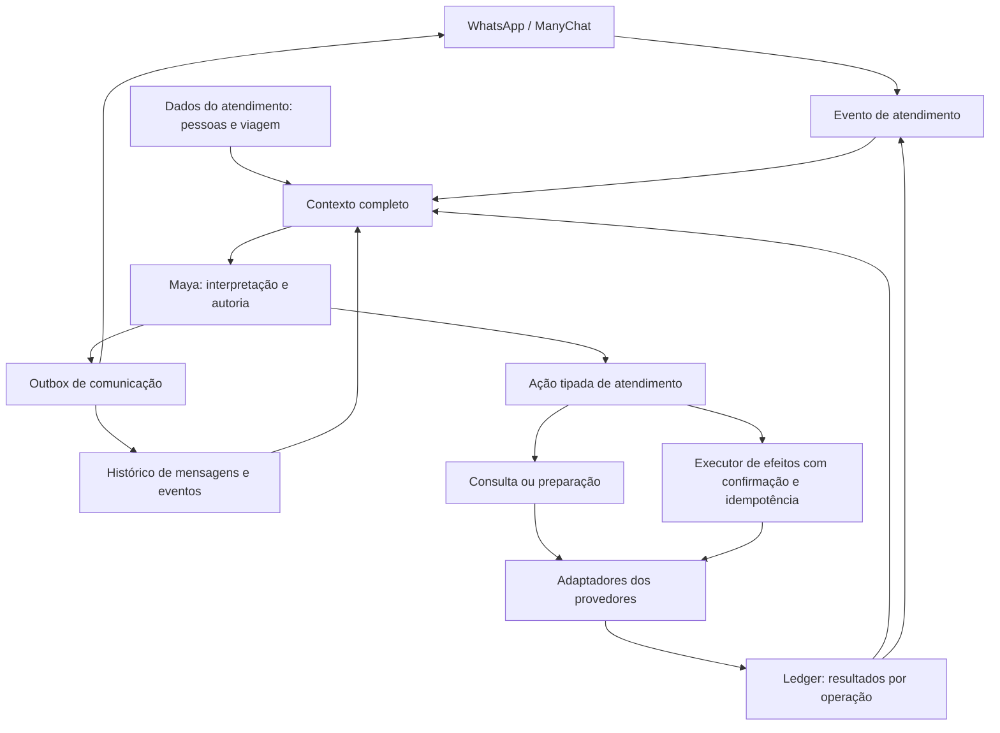

# V2 — atendimento simples com contexto completo

## Decisão e estado

Carlos aprovou nesta conversa a **simplificação incremental: contexto completo, resultados por componente e remoção dos protocolos redundantes**. A aprovação exclui produção e operações reais. Este documento formaliza esse desenho; Carlos aprovou a especificação com “Siga” nesta conversa, autorizando também o Graphify como apoio.

- Base: `8980646d5615db9ecb32c97f4579ba09080dc02a`, candidato confirmado pela autoridade do runtime para o contato isolado.
- Branch: `refactor/v2-atendimento-simples-727d3625`.
- Worktree: `/home/ubuntu/agente-v2/.worktrees/atendimento-simples-727d3625`.
- GA não muda; V3, legado e Maya Ops ficam fora da mudança.
- A referência operacional continua sendo `ACTIVE_RUNTIME.json`; esta especificação não declara um novo runtime ativo.

## Objetivo

A Maya deve atender uma conversa natural de WhatsApp usando tudo que o lead já informou, consultar ferramentas e explicar seus resultados sem exigir que a conversa siga um roteiro exato. A simplificação elimina informação escondida, estados duplicados na interface do modelo e correções semânticas artificiais; não elimina idempotência nem conferência de efeitos.

Não serão criados filtros de PII, mascaramento de dados no contexto, regex de intenção, agente revisor de texto ou fiscal de idioma.

## Causas que o desenho deve remover

1. `ModelRequest` proíbe valores pessoais em `state_facts` e fornece somente `private_customer_fact_names` e `passenger_manifest_status`. O prompt manda usar apenas a mensagem corrente para atualizar dados. A Maya não consegue reutilizar de forma confiável os valores persistidos.
2. O titular e os passageiros são tratados como fontes sem ligação semântica explícita, permitindo pedir novamente dados já coletados de uma mesma pessoa.
3. O histórico carregado tem `LIMIT 4`. A saída de uma mensagem da janela remove valores que não reaparecem como contexto factual.
4. O resolver converte resultados individuais em `partial_failure`; o modelo não recebe referência e certeza por componente.
5. Mensagens terminais do completion projector vão ao outbox, mas não ao histórico conversacional da Maya.
6. O bloqueio comercial considera qualquer status presente, inclusive terminal. Isso confunde prevenção de nova execução com bloqueio de conversa e consultas.
7. O prompt principal e o sufixo de execução descrevem estados terminais de maneiras incompatíveis.
8. O parser Bókun lê `options[].allowedMethods`; o checkout observado usa `options[].paymentMethods.allowedMethods`.

As causas 1–7 exigem correção coordenada de contexto, continuidade e contratos; a causa 8 é uma correção localizada de integração.

## Arquitetura-alvo

A seta `R → E` representa notificação deduplicada quando há resultado novo, não um loop incondicional de geração. Ledger e outbox continuam separados. O diagrama descreve responsabilidades; não autoriza novos serviços ou outro framework.

## Contrato de contexto

### Dados do lead e pessoas

- Fornecer à Maya os valores conhecidos de nome, e-mail, telefone de contato, país, nascimento, gênero e demais dados já aceitos pelo atendimento, quando existentes.
- Não substituir valores por hashes, máscaras ou listas de nomes presentes. Valores do atendimento podem ser usados naturalmente na resposta.
- Separar a identidade do canal, que continua pertencendo ao ManyChat, dos telefones de contato informados na conversa. Usar um telefone de contato não muda o destinatário da sessão.
- Representar uma pessoa por uma referência estável dentro do atendimento; titular, pagador e viajante são papéis que apontam para pessoas. Não copiar a mesma pessoa para novos cadastros independentes.
- A Maya identifica semanticamente a quem pertence cada dado e informa a associação entre pessoa e papel. O controlador valida referências e persiste essa decisão; não decide a pessoa por comparação de nomes, substring ou regex.
- Quando o lead identifica um passageiro existente como titular, reutilizar seus valores já conhecidos. Uma pergunta só se justifica se falta um requisito real ou a identificação é de fato ambígua.
- Correções explícitas do lead atualizam a pessoa correspondente. Um dado antigo de perfil não deve desfazer uma correção conversacional posterior. Divergências não resolvidas ficam visíveis à Maya, em vez de serem escondidas por um marcador de completude.
- Uma correção que altera os parâmetros de uma reserva pendente invalida apenas a aprovação afetada; não apaga os outros dados nem impede responder à pergunta do turno.

A implementação reutiliza o armazenamento existente e acrescenta nele a ligação de pessoas/papéis quando necessária. Não cria um segundo banco de contexto. Para estado antigo, a leitura fornece os registros existentes sem assumir que duas pessoas são iguais; a Maya pode estabelecer a associação pela conversa. Reservas históricas mantêm seu snapshot imutável de execução.

### Viagem, escolhas e consultas

- Expor a viagem e as preferências consolidadas, escolhas correntes e resumo aguardando confirmação.
- Manter evidência das consultas anteriores com data de observação. Recapitular uma consulta não exige refazê-la; executar uma reserva exige evidência apropriada e atual.
- A seleção referencia a opção conhecida. O runtime obtém seus parâmetros no registro correspondente; a Maya não reconstrói IDs, hashes ou todos os fatos do binding.
- Aproveitar o contrato tipado existente onde ele já expressa claramente uma ação. Não trocar SDK ou protocolo somente para renomear operações.

### Histórico

- Retirar o limite semântico fixo de quatro trocas como mecanismo de continuidade. A janela recente respeita orçamento de contexto, mas os dados factuais persistidos, escolhas e resultados operacionais não dependem de a mensagem original ainda estar nessa janela.
- Mensagens do lead, respostas da Maya e eventos de resultado compõem uma sequência coerente, com identificação estável e ordenação causal.
- Separar mensagem planejada, enfileirada, aceita pelo canal e entrega comprovada. A Maya não deve tratar envio pendente como algo já lido pelo cliente.
- No estado preexistente, a montagem de contexto inclui os resultados do ledger e as mensagens terminais já registradas no outbox sem reenviá-las nem alterar seu texto.
- O contexto é uma leitura derivada das fontes canônicas, não uma nova cópia persistida do mundo. Mudanças concorrentes são tratadas pelo mecanismo de versão já existente.

## Resultados por componente

Cada operação relevante fornece à Maya:

- qual serviço e qual seleção estão envolvidos;
- se está pendente, em execução ou encerrada;
- certeza de efeito: não chamada, chamada sem efeito final, efeito confirmado ou resultado desconhecido;
- referência do fornecedor quando existente;
- condições/valor efetivamente associados;
- etapa e causa de impedimento quando comprovadas;
- situação do pagamento correspondente;
- vínculo com o que já foi comunicado.

`partial_failure` pode existir como resumo derivado, mas nunca substitui esses resultados.

Uma operação encerrada não bloqueia, por sua mera existência, fatos novos ou consultas. A prevenção de repetição protege a operação específica e o escopo já confirmado. Para resultado desconhecido, não repetir essa operação sem reconciliação; continuar respondendo e atendendo assuntos independentes.

Em um pacote parcialmente confirmado, a parte confirmada permanece confirmada. A Maya não a descreve como incerta, não a repete para tentar concluir a outra parte e não afirma falha do meio de pagamento quando ele não foi chamado.

A regra financeira atual de suprimir a iniciação automática de pagamento para pacote parcialmente reservado não é modificada. Uma recuperação que mude o escopo comercial precisa de decisão do lead, não de uma política nova inventada nesta refatoração.

## Autoria da conclusão e recuperação

- O resultado durável de uma operação dispara um evento de atendimento para a mesma Maya, com contexto atualizado.
- Remover a redação normal de conclusões comerciais por `_confirmation_text`, `_terminal_failure_text` e `_payment_text` do completion projector quando a rota substituta estiver implementada.
- Preservar referência, total e link retornados por ferramentas como fatos; Maya redige a explicação. Não adicionar outro modelo para julgar sua redação.
- Deduplicar evento de conclusão por resultado/operação usando a identidade durável existente. Uma repetição de ciclo não gera outra mensagem para o mesmo resultado.
- Persistir a resposta antes da entrega. Falha de geração deixa o evento de comunicação pendente; falha de entrega deixa a mensagem pendente. Nenhuma das duas repete a reserva ou o pagamento.
- A falha de geração/entrega deve aparecer na observabilidade existente, sem criar alertas ou handoffs externos novos nesta fase.
- Se o lead escreve antes da notificação de conclusão, sua resposta já recebe o resultado durável; uma notificação pendente deve ser consolidada com essa comunicação, evitando conclusões duplicadas.

## Remoção dos protocolos redundantes

O plano deve eliminar, não apenas deixar sem uso:

1. `private_customer_fact_names` como substituto model-facing dos valores;
2. `passenger_manifest_status` como única representação model-facing das pessoas;
3. instruções que proíbem reutilizar valores persistidos ou limitam atualizações à mensagem corrente;
4. `active_execution_status` como único contexto dos resultados;
5. bloqueio global de progressão baseado apenas em status terminal presente;
6. prompt/sufixo com interpretações contraditórias de estado;
7. caminhos específicos de revisão de confirmação, seleção, progresso e recapitulação que fazem a Maya reinterpretar a mesma mensagem por flags de controle;
8. correções públicas usadas para compensar alterações semânticas de proposta feitas pelo controlador;
9. geração de texto comercial terminal separada do histórico da Maya.

Os substitutos são contexto completo, ações claras e resultados de ferramentas. Uma chamada da Maya após uma consulta ou conclusão de ferramenta é parte normal do atendimento; não é um revisor adicional. Falha estrutural de schema continua sendo erro de contrato, mas não autoriza inspecionar ou reescrever prosa por significado.

Não remover formatos legados necessários para ler ledger/receipts históricos; compatibilidade de leitura não deve manter dois caminhos ativos de atendimento. Funções que só atendiam os protocolos removidos, seus prompts e testes de implementação obsoletos saem no mesmo incremento que o substituto.

## Bókun

- Interpretar `options[].paymentMethods.allowedMethods` no adaptador de checkout.
- Selecionar uma opção que realmente permita `RESERVE_FOR_EXTERNAL_PAYMENT`; valores e parâmetros vêm dessa mesma opção.
- Fixture de contrato conserva a estrutura observada, sem payload bruto ou dados reais versionados.
- Testar a chamada completa no transporte simulado: opção válida chega ao submit uma vez; opção ausente/inválida não chega.
- Ausência local de opção permitida não pode ser reportada como rejeição de um submit que não ocorreu. Registrar estágio/causa junto ao resultado sem efeito final.
- Diferenciar efeito auxiliar de carrinho de reserva confirmada. Não concluir ausência de qualquer escrita apenas porque não houve booking final.
- Não ampliar fallback para variantes não comprovadas apenas para fazer testes antigos passarem.

## Controles preservados

- destinatário e identidade de evento fornecidos pelo canal;
- confirmação do cliente ligada ao resumo efetivamente apresentado;
- binding de produto, datas, participantes, total e moeda;
- requisitos reais dos fornecedores, validados na fronteira apropriada;
- idempotência, concorrência e reconciliação de resultado desconhecido;
- obrigações financeiras e execução sem duplicação;
- ledger de operação separado do outbox de comunicação;
- provider writes fora do orçamento restante de uma chamada conversacional;
- gates operacionais, readiness e autoridade do runtime.

Validação determinística de contratos não é interpretação semântica da mensagem. Essas regras devem ter um dono e não ser recitadas repetidamente no prompt.

## Sequência de implementação

1. **Contrato Bókun:** teste causal do formato real, parser e taxonomia da falha anterior ao submit.
2. **Contexto do atendimento:** valores completos, associação pessoa/papel, precedência de correções e continuidade além de quatro trocas. Retirar a interface de presença substituída.
3. **Resultados e histórico:** componentes completos, estados terminais sem bloqueio global, evento de conclusão para Maya, histórico/outbox coerentes e deduplicados.
4. **Redução do coordenador e prompt:** remover protocolos específicos de revisão/correção que ficaram redundantes, mantendo os contratos de ferramentas e efeitos.

Cada incremento tem regressão causal antes da mudança e suíte afetada depois. Não é autorizado promover um incremento incompleto ao contato real para descobrir o que falta.

## Aceite

| Cenário | Evidência exigida |
|---|---|
| Dados em várias mensagens | Valores chegam ao request real do modelo e são reutilizados sem nova coleta. |
| Passageiro indicado depois como titular | Mesma pessoa/dados abastecem a reserva, sem copiar de outro viajante. |
| Correção acompanhada de pergunta | Correção persistida e pergunta respondida no mesmo atendimento. |
| Histórico além de quatro trocas / reabertura | Dados, resumo e resultados duráveis permanecem no contexto. |
| Hospedagem confirmada, passeio sem booking | A resposta imediata e o follow-up distinguem os componentes e preservam a referência confirmada. |
| Geração/entrega falha ou mensagem duplicada | Reserva/pagamento executam uma vez; conclusão não é duplicada. |
| Resultado incerto | Operação não é repetida; dúvidas e escopo independente continuam atendidos. |
| Checkout Bókun observado | Submit emitido uma vez com opção válida; inexistência da opção resulta em causa local explícita. |
| Arquitetura reduzida | Protocolos substituídos realmente removidos, sem flags mortas ou segundo agente semântico. |
| Conversa natural | Avaliação com modelo real permite variações de ordem, pausa, correção e idioma, sem respostas roteirizadas. |

O plano registra chamadas de modelo por motivo, latência, resultados e efeitos; não inventa metas numéricas sem baseline. Suíte unitária prova contratos, não qualidade da conversa.

Conversas com modelo real exigem harness isolado e efeitos de negócio fechados, com evidência do modelo e ferramentas efetivamente usados. Testes com transportes simulados são identificados como tais. Escritas reais de reserva, cobrança, handoff ou WhatsApp e qualquer deploy dependem de autorização separada e reconciliação da reserva já existente.

## Não objetivos

- reescrever o kernel transacional ou substituir o framework;
- reunir todos os bancos em um novo banco;
- alterar catálogo, política comercial ou regra financeira de pacote parcial;
- migrar/cancelar/repetir reservas reais;
- promover para contato isolado ou GA;
- editar bancos ativos ou manifest para acomodar divergência;
- ampliar escopo para V3, legado ou Maya Ops;
- criar política de privacidade, censura de dados do atendimento ou detecção de PII.

## Revisão e baseline

- Desenho: aprovado por Carlos via escolha explícita de simplificação incremental; documento formal aprovado com “Siga” nesta conversa.
- Fonte inicial: worktree limpa no commit base verificado.
- Baseline focal: `tests/test_v2_bokun_write_transport.py` e `tests/test_v2_active_execution.py`, executados com ambiente limpo e plugins pytest automáticos desabilitados: **60 passed in 1.33s**.
- A tentativa inicial de runner contendo `uvicorn` foi bloqueada pelo detector de processo longo da ferramenta antes da execução. O runner sem essa dependência não necessária executou e substitui a tentativa; não houve teste de produto reprovado nessa etapa.
- Não foram implementadas correções nem executados testes E2E novos. Os testes existentes ainda incluem o fixture Bókun incorreto identificado pela investigação.
- Revisão interna: contexto não é outro banco; pessoa não é inferida pelo controlador; resultado não autoriza retry; falha de mensagem não repete reserva; compatibilidade histórica não mantém uma segunda implementação ativa.

Execução autorizada em incrementos, com plano causal antes de cada conjunto de alterações. Primeiro plano: `docs/superpowers/plans/2026-09-18-v2-atendimento-simples-01-bokun.md`. Produção e operações reais permanecem fora da autorização.
